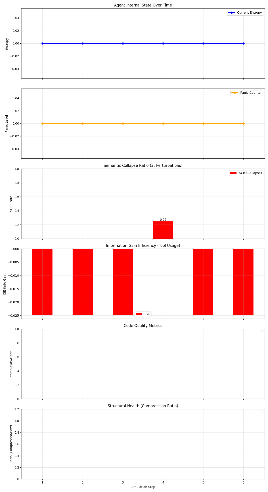

# Entropic Stress-Testing of Tool-Using LLM Agents Under Non-Stationary Task Constraints

**Authors:** [Your Name], [Supervisor/Co-authors]  
**Affiliation:** [University / Lab]  
**Target:** arXiv + [venue TBD]  
**Status:** Draft (needs final benchmark runs)

## Abstract
Current evaluation frameworks for tool-using Large Language Model (LLM) agents largely measure success on fixed objectives (static solvability). In real deployments, objectives can shift mid-execution (non-stationary constraints), and agents can silently fail by persisting with obsolete plans, repeating actions, or “hallucinating progress”. We introduce an **Entropic Stress-Test** evaluation harness that injects controlled requirement changes (“shocks”) into deterministic sandboxes and measures agent stability and adaptation. We propose **Semantic Collapse Ratio (SCR)**, computed via branching probes that sample multiple possible next steps and quantify their semantic divergence, and **Information Gain Efficiency (IGE)**, a token-cost-normalized uncertainty reduction measure when token logprobs are available. A key practical finding is that logprob-based confidence is frequently unavailable or inconsistent across providers/models; treating missing logprobs as “0.0 entropy” is invalid. We show how SCR plus outcome-based validators provide a robust evaluation signal even when token-level confidence is missing, enabling reproducible comparisons across heterogeneous model providers.

## 1. Introduction
The rapid adoption of LLM-based agents for autonomous software engineering has highlighted a critical reliability gap. While agents perform well on static benchmarks, their performance degrades significantly in long-horizon tasks with changing requirements. This degradation is often characterized not by immediate failure, but by a gradual "Context Rot," where the agent's internal state drifts from the ground truth, leading to repetitive loops and hallucinated progress.

Standard observability metrics, such as token-level entropy or perplexity proxies, are unreliable in practice: many APIs do not expose token logprobs, and models optimized for helpfulness can produce confident language even when plans are brittle. This creates an observability gap for agent operators: failures may be silent until an external validator fails (or a human notices).

This paper contributes:
1. **A reproducible non-stationary evaluation harness** (orchestrator + deterministic sandboxes + validators) for tool-using agents under controlled requirement shocks.
2. **A provider-agnostic stability probe (SCR)**: an active measure of plan instability under shocks via semantic divergence across branched next-step generations.
3. **A practical observability result:** entropy proxies derived from token logprobs are often unavailable across providers/models; we therefore report **entropy coverage** and treat missing entropy as `null`, not `0.0`.
4. **A secondary behavioral result:** even when entropy is available, it can remain flat/low around shocks while agent behavior destabilizes, whereas SCR spikes near perturbations.

## 2. Methodology

### 2.1 The Entropic Stress-Test Framework
The framework consists of three decoupled components:
* **Orchestrator:** drives the step loop, injects shocks at pre-specified steps, and coordinates probes (`src/orchestrator/engine.py`).
* **Sandbox:** deterministic filesystem + command execution, with Docker optional and a local fallback (`SANDBOX_BACKEND=auto|local`).
* **Monitor + Validators:** logs per-step metrics and determines objective success with task-specific validators (`src/scenarios/validation_ops.py`).

### 2.2 Scenarios and Non-Stationarity
We define scenarios as deterministic sandboxes plus a scripted schedule of requirement changes (“perturbations”). Each scenario specifies:
1) an initial prompt,  
2) an optional list of perturbations (step index + new instruction), and  
3) a validator that checks artifacts produced in the sandbox (e.g., output files).

The benchmark suite used for paper tables is configured via `benchmarks/suite_v2.json` and executed using `run_benchmark.py`.

### 2.3 Problem Setup and Measurement Protocol
We model each run as an episode of discrete steps. At each step, the controller either (a) injects a scheduled perturbation, or (b) asks the agent for an **action intent**:
* `tool_use`: a tool name plus JSON arguments (e.g., write a file, run a command) executed in the sandbox.
* `llm_reply`: a natural-language response (used when the agent claims completion or cannot act).

Each step is logged as a structured record (JSONL) containing: scenario ID, step index, event type, tool name (if any), validator status, token usage (if provided), and optional metrics.

**Token accounting.** When the provider returns token usage, we record `prompt_tokens`, `completion_tokens`, and `total_tokens`. Branching probes incur extra model calls; we track these separately as `probe_total_tokens` and report totals both with and without probes.

**Success.** For paper tables we use deterministic scenario validators that check the sandbox artifacts (e.g., output files). Runs are considered successful if the validator passes.

**Entropy coverage.** Token logprobs are not universally available. We therefore treat `current_entropy` as optional and report **entropy coverage**: the fraction of non-probe steps where `current_entropy` is present (non-null). This prevents analyses that accidentally interpret missingness as confidence.

### 2.4 The Branching Probe & Semantic Collapse Ratio (SCR)
To detect "hidden confusion," we introduce the **Branching Probe**. At critical decision points (e.g., after a requirement injection), the Orchestrator forks the agent's state and forces it to generate $N$ independent "next step" thoughts (typically $N=3$ for cost, configurable).

We define the **Semantic Collapse Ratio (SCR)** as the average pairwise cosine distance between the embeddings of these $N$ generations:

$$ SCR = \frac{1}{N(N-1)} \sum_{i \neq j} (1 - \cos(\theta_{i,j})) $$

Where $\theta_{i,j}$ is the angle between embedding vectors $v_i$ and $v_j$.
*   **Low SCR (~0.0):** The agent is resolute; all parallel thoughts converge on the same plan.
*   **High SCR (>0.2):** The agent is "fractured"; parallel thoughts diverge significantly, indicating internal confusion despite potentially confident language.

### 2.5 Information Gain Efficiency (IGE)
To measure "thrashing" (tool use without progress), we define **Information Gain Efficiency (IGE)**:

$$ IGE = \frac{H_{pre} - H_{post}}{Cost_{tokens}} $$

Where $H$ is a chosen-token surprisal proxy computed from token logprobs (average negative log probability of the sampled tokens). Because many providers/models do not expose token logprobs, we:
* treat missing $H$ as **undefined** (`null`), not `0.0`, and
* report **entropy coverage** (fraction of steps with entropy present) as a first-class statistic.

### 2.6 Operational Loop Detection (No-Logprob Fallback)
When logprobs are absent, entropy-based “panic” detection is unavailable. We therefore include an operational fallback: repeated identical actions (stable tool+args signature or near-identical replies) increment a loop counter and can trigger intervention. This is not a substitute for entropy, but it prevents silent infinite loops in zero-logprob deployments.

## 3. Experiments

### 3.1 Setup: The "Drug Filter Shock" Scenario
We designed a scenario simulating a real-world data engineering task:
1.  **Initial Goal:** Filter `drugs.csv` by `weight < 150` and write `filtered_by_weight.csv`.
2.  **Phase 1 (Steps 1-3):** Agent writes code and generates the CSV.
3.  **Shock 1 (Step 4):** A "Manager" injects a constraint change: the weight filter must now use an external `get_molecular_mass(drug_name)` API.
4.  **Shock 2 (Step 7):** The primary filter reverts back to the `weight` column, but the molecular mass API connection must remain present in code for future use.

### 3.2 The "Rescue" Protocol
We include an optional intervention protocol. After persistent “panic” (entropy-based when available, loop-based otherwise), the controller can: (a) inject a corrective system message, or (b) in a two-model setup, hand off control to a stronger “rescue” model. This protocol is evaluated separately from baseline runs to avoid conflating detection and recovery.

### 3.3 Evaluation Outputs (Paper Tables)
We report:
* **Success rate** (validator pass rate) per (model, scenario)
* **Median steps** to completion / termination
* **Token usage** (including optional probe tokens)
* **Entropy coverage** (fraction of steps with entropy present)
* **Peak SCR at shocks** (median peak SCR over perturbation events)

These aggregates are produced by:
* `run_benchmark.py` → raw results CSV
* `analyze_benchmark.py` → paper-ready summary CSV

Reproducibility runsheet: `docs/PAPER_RUNSHEET.md`.

## 4. Results

### 4.1 Primary Result: Entropy Coverage Makes “Entropy-Only” Observability Non-Viable
Across providers/models, token logprobs may be missing or inconsistent. As a result, entropy proxies cannot be relied upon as the sole observability signal in multi-provider sweeps. We treat entropy as an optional signal and report **entropy coverage**: the fraction of non-probe steps with entropy present.

**Key implication:** any evaluation that compares “entropy” across models without reporting coverage is at risk of silently mixing real values with missingness artifacts (e.g., treating missingness as `0.0`). [CITE]

### 4.2 Secondary Result: Entropy Can Decouple from Stability Even When Available
When token logprobs are available, chosen-token surprisal proxies may remain flat/low around perturbations even as agent behavior becomes unstable (e.g., repeating obsolete plans, oscillating between incompatible actions). In contrast, SCR is designed to measure plan instability directly by quantifying divergence across sampled next steps.

We therefore use SCR as the primary instability indicator around shocks, and entropy (when present) as a complementary, model-specific signal rather than a universal baseline. [CITE]

### 4.3 Metric Comparison (Qualitative + Aggregate)
We analyze metric behavior around perturbation steps. SCR spikes at shocks in scenarios where the agent must revise plans to satisfy new requirements. We report peak SCR at perturbations (median over repeats) as a compact instability summary statistic.

**TODO (after final runs):** include correlation plots between (SCR at shock, success rate) and (entropy proxy, success rate), and report confidence intervals across repeats.

*Figure 1: Experiment Summary. Top to Bottom: (1) Entropy (flatline), (2) Panic Counter, (3) SCR (spikes at shock), (4) IGE, (5) Code Complexity, (6) Compression Ratio.*

## 5. Related Work
We position this work relative to: (1) tool-using agent benchmarks, (2) long-horizon context management, and (3) agent failure taxonomies. Our focus is not a new agent policy, but a reproducible *stress-test* harness for non-stationary objectives plus robust observability metrics when common confidence signals are missing.

**TODO:** finalize citations from `helper/thesis-references.bib` and add canonical references for CoT/ReAct/agent benchmarks used in the experimental design.

## 6. Discussion & Future Work
Active probing introduces costs and rate-limit pressure; our implementation supports configurable probe modes (off / shock-only / periodic) to study this trade-off. A practical limitation is that branching probes can stress free-tier API limits and require careful throughput planning.

**Future Work includes:**
1. **Repo repair scenarios:** extend deterministic validators to multi-file codebases with unit tests.
2. **Context interventions:** compare model handoff vs context pruning/summarization policies under the same perturbation schedule.
3. **Ablations:** probe branch count, embedding model choice for SCR, and budget/cost trade-offs.

## 7. Conclusion
We propose a reproducible framework for evaluating tool-using LLM agents under non-stationary constraints. The key practical contribution is robust observability when token-level confidence is unavailable: SCR probes and outcome-based validators remain informative across heterogeneous providers. This enables paper-ready benchmark tables that measure both *success* and *stability under shocks*.

## References
References will be finalized from `helper/thesis-references.bib` in the camera-ready version.
